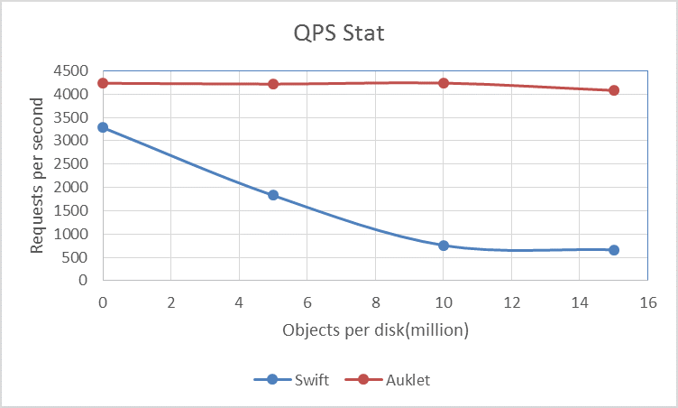
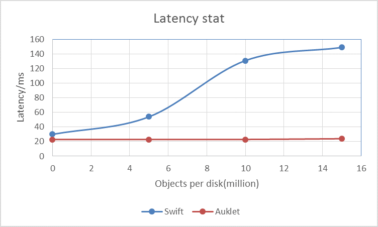
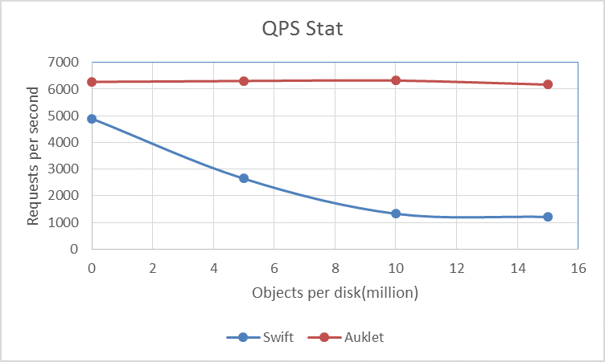
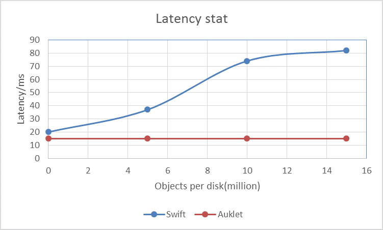

# Introduction
The main problem of replication engine is that the performance degrades when number of object grows in the disks. So we run a lot of benchmarks to show if Auklet works as designed.

With pack engine in Auklet, since small objects will be packed into a bundle file, ideally the performance should not degrade regardless of the number of objects in the disks. So we have conducted severl benchmarks to prove the design.

Our testbed is made up of 12 hosts each with following setup:

```
OS: CentOS 7.2
CPU: Intel(R) Xeon(R) CPU E5-2620 2.00GHz, 24 cores
Memory: 128G
Disks: 3T Seagate SATA 7200rpm x 12
LSI MegaRAID SAS RAID controller
```

Besides, 4 extra hosts with the same setup are used as ssbench clients.

# Benchmark result

2 groups of experiments have been conducted, one is all write requests test and the other is load with half write and half read. And 2 metrics are measured here.

* QPS(queries per second)/RPS(requests per second), we use these 2 words interchangely in this post.
* Average latency

We get the 2 metrics directly from the output of ssbench.

### full writes



*queries per second*



*average latency*

### reads and writes



*queries per second*



*average latency*
